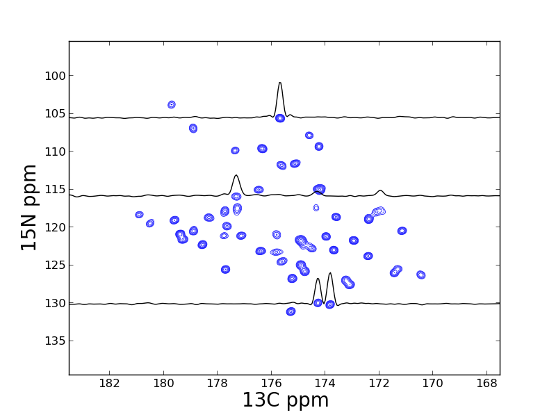

<!-- Guidance:
Logo: The logo needs have the text "Logo" inside the square bracket place holder to be recognized at the App Library.
Tool name: First single hashtag (#) will be taken as tool name.
Version: Should always go after the first hastag and before the second hastag. The line needs to respond to the regexp "^Version: (.+)" being the first group the actual version.

Fields: for the App Library, the following fields will be parsed:

# Name of the tool
Version: z.x-whatever
## Short description
## Description
## Key features
## Publications
## Screenshots
## Tool Authors 
- Author 1 and affiliation
- [Author 2](link_to_author_2) and affiliation
## Container Contributors
- Contributor 1
- [Contributor 2](link_to_contributior_2) and affiliation
## Website
## Usage Instructions

Free text with triple tick code blocks, comprising docker, ipython and galaxy usage

## Installation 

They all have to be at the second hashtag level

For screenshots, you should use the following scheme:


-->


# nmrglue


## Short description

nmrglue: a module for working with NMR data in Python.

## Description

Nmrglue is a module for working with NMR data in Python. When used with the NumPy, SciPy, and matplotlib packages nmrglue provides a robust environment for rapidly developing new methods for processing, analyzing, and visualizing NMR data. Nmrglue also provides a framework for connecting existing NMR software packages.

## Key features

Nmrglue has the ability to read, write and convert between a number of NMR file formats including Agilent/Varian, Bruker, NMRPipe, Sparky, SIMPSON, and Rowland NMR Toolkit files. The files, which are represented in Python as dictionaries of spectral parameters and NumPy ndarray objects, can be easily examined, modified and processed as desired.

Nmrglue provides a number of functions for processing NMR data such as apodization, spectral shifting, Fourier and other transformations, baseline smoothing and flattening, and linear prediction modeling and extrapolation. In addition new processing schemes can be implemented easily using the nmrglue provided functions and the multitude of numerical routines provided by the NumPy and SciPy packages.

When used in conjunction with the matplotlib (or other) python plotting library nmrglue can be used to create publication quality figures of NMR spectrum or examine data interactively. For example:




Nmrglue can be used to analysis NMR data, with routines to perform peak picking, multidimensional lineshape fitting (peak fitting), and peak integration provided within the package. New analysis methods can be rapidly developed and tested in Python or by integrating Fortran and C/C++ code.

## Tool Authors 
- Jonathan J. Helmus <jjhelmus@gmail.com>

## Container Contributors
- [Kristian Peters](https://github.com/korseby) (IPB-Halle)

## Website

* http://www.nmrglue.com
* http://github.com/jjhelmus/nmrglue

## Installation 

For local individual installation:

```bash
docker pull docker-registry.phenomenal-h2020.eu/phnmnl/nmrglue
```

## Usage Instructions

For direct docker usage:

```bash
docker run docker-registry.phenomenal-h2020.eu/phnmnl/nmrglue ...
```

## Publications

- J.J. Helmus, C.P. Jaroniec, Nmrglue: An open source Python package for the analysis of multidimensional NMR data, J. Biomol. NMR 2013, 55, 355-367. doi:10.1007/s10858-013-9718-x
